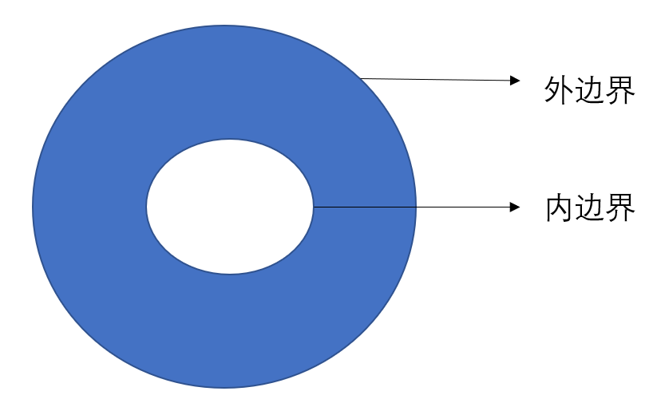

## 各类积分之间的联系
$\S$ 16.3
### Green 公式
$\S$ 16.3.1

- theorem : (Green 公式) 平面闭区域由有限条可求长简单闭曲线围成, $\partial D$ 表示正向边界, $P,Q,\frac{\partial Q}{\partial x},\frac{\partial P}{\partial y}\in C(D)$. 则有:
$$\oint_{\partial D}P\mathrm dx+Q\mathrm dy = \iint_{D}\begin{vmatrix}\frac{\partial }{\partial x} & \frac{\partial }{\partial y} \\ P & Q \end{vmatrix}\mathrm d\sigma $$
> 边界正向选取 : 内顺外逆
> Green 公式是联系平面积分与边界线积分的桥梁
> 非闭曲线上的线积分可以变成闭曲线上线积分再用 Green 公式
- Green 公式的向量形式 : 
$$\oint_{\partial D}(P,Q)\cdot \mathrm ds = \oint_{\partial D}(P,Q)\cdot (\mathrm dx,\mathrm dy) = \oint_{\partial D}(P,Q)\cdot \bm\tau \mathrm ds = \iint_{D}\left(\frac{\partial Q}{\partial x}-\frac{\partial P}{\partial y}\right)\mathrm d\sigma$$
其中 $\bm\tau$ 表示正向单位切向量, $\bm\tau = (\cos\theta,\sin\theta) = \frac{(\mathrm dx,\mathrm dy)}{\mathrm ds}$

- theorem : (二维 Stokes 公式) $P,Q,\frac{\partial Q}{\partial y},\frac{\partial P}{\partial x}\in C(D)$. 则有:
$$\oint_{\partial D}(P\cos(\boldsymbol n,x)+Q\cos (\boldsymbol n,y))\mathrm ds = \oint_{\partial D}\{P,Q\}\cdot \boldsymbol n\;\mathrm ds = \iint_{D} (\frac{\partial Q}{\partial y}+\frac{\partial P}{\partial x})\mathrm d\sigma$$
其中 $\boldsymbol n$ 表示外法向量, 两个余弦内角是其分别与 $x,y$ 轴正向的夹角.
> $\boldsymbol n\cdot \mathrm ds = (\mathrm dy,-\mathrm dx)$, 所以两个公式其实就是互换 $P,Q$
> Green 公式描述 $P,Q$ 在切向量上的投影, 二维 Stokes 公式描述 $P,Q$ 在法向量上的投影 

#### wgx物理小课堂
- 流场 $v=(P(x,y),Q(x,y))$
- 点的**旋度** : $\frac{\partial Q}{\partial x}-\frac{\partial P}{\partial y}$
- 边界 $\partial D$ 的**环流量** : $\oint_{\partial D}P\mathrm dx+Q\mathrm dy$
> 边界线上环流量等于区域上各点旋度的叠加. $\Leftrightarrow$ Green公式
> $$\oint_{\partial D} \bm v\cdot \bm \tau\mathrm ds = \iint_D \text{rot } \bm v\mathrm d\sigma$$
- 点的**散度** : $\text{div} \; v = \nabla \cdot v = \frac{\partial P}{\partial x}+\frac{\partial Q}{\partial y}$ (这个没有方向), 单位体积单位时间生出的流体量
  - 散(san,四声)
  - **汇, 源** : 有水漏出, 有水生成的地方
- 边界的**总通量** : $\oint \boldsymbol{v}\cdot\boldsymbol{n}\mathrm ds$
> 边界线上总通量等于区域上各点散度的叠加. $\Leftrightarrow$ Gauss公式二维情形
> $$\oint_{\partial D}v\cdot \boldsymbol{n} \mathrm ds = \iint_D \text{div }v\mathrm d\sigma$$
> wgx认为这个积分用好了后面都很自然
#### 调和函数
- def : $\Delta u = 0$, 则称 $u$ 为**调和函数**.
  - $\Delta u = \nabla \cdot \nabla u$
- theorem : (Green 第二公式) $D$ 由有限条逐段光滑曲线围成, $u,v\in C^2(D)$, 则有
$$\begin{align*}\iint_D \Delta u\mathrm d\sigma &= \oint_{\partial D}\frac{\partial u}{\partial \boldsymbol{n}}\mathrm ds\\\iint_D v\Delta u\mathrm d\sigma &= -\iint_{D}(\frac{\partial u}{\partial x}\frac{\partial v}{\partial x}+\frac{\partial u}{\partial y}\frac{\partial v}{\partial y})\mathrm d\sigma +\oint_{\partial D}v\frac{\partial u}{\partial \boldsymbol{n}}\mathrm ds\\\iint_D (v\Delta u-u\Delta v)\mathrm d\sigma &= \oint_{\partial D}(v\frac{\partial u}{\partial \boldsymbol{n}}-u\frac{\partial v}{\partial \boldsymbol{n}})\mathrm ds\end{align*}$$

>  $\nabla\cdot(v\nabla u)=\nabla v\cdot\nabla u +v\nabla u$
