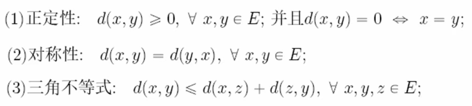
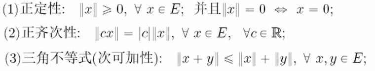
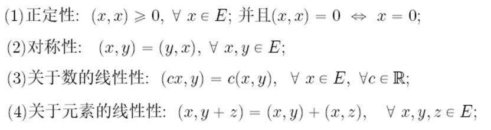

___

# 第十三章 多元函数的极限和连续 

___

## Euclidian Space
$\S$13.1
### $\mathbb R^n$的定义
$\S$13.1.1
#### 距离
- def : $d : E\times E\rightarrow \mathbb R$ 满足: 

则称为集合 $E$ 上的一个**距离**
- def : $(E,d)$ 记为**距离空间**, 又叫**度量空间**
#### 范数(模)
- def : $\|\cdot\| : E\rightarrow \mathbb R$ 满足: 

则称为线性空间 $E$ 上的一个**范数(模)**
- def : $(E,\|\cdot\|)$ 记为**赋范线性空间**
- theorem : 赋范线性空间一定是距离空间,反之不一定(正齐次性和三角不等式)
#### 内积
- def : $(\cdot,\cdot) : E\times E\rightarrow\mathbb R$ 满足: 

则称为线性空间 $E$ 上的一个**内积**
- def : $(E,(\cdot,\cdot))$ 记为**内积空间(Hilbert空间)**
- theorem : 内积空间一定是范数空间
- 带有内积(范数,距离)的$\mathbb R^n$称为n维欧几里得空间(Euclidian Space), 简称**欧氏空间**

### 点列的极限
$\S$13.1.2
- def : **邻域,空心邻域**
  - $B(x_0,\delta)$ : 球形邻域
  - $N(x_0,\delta)$ : 方形邻域
### 点集
$\S$13.1.3
#### 聚点
- def : $x\in \mathbb{R}^n$ 的任意 $\delta$ 邻域 $U(x,\delta)(\delta > 0)$ 都有$E$ 中异于 $x$ 的点,则称$x$为$E$的**聚点**或**极限点** 
  - 若$x$是$E$的聚点$\Rightarrow U(x,\delta)(\delta > 0)$中必有$E$中无限多个点
  - $x$是$E$的聚点与$x$是否属于$E$无关
- def : 当$x\in E$且$x$不是$E$ 的聚点时,则称$x$为$E$的**孤立点**,此时必存在$\delta_0>0$,使得$U(x,\delta_0)\cap E=\{x\}$
- theorem : $x$是$E$的聚点 $\Leftrightarrow \exist \{x_k\}\in E,使得\lim_{k\rightarrow +\infty} x_k = x$ 
> 若集合$A$中每一个点的任何邻域中都有集合B中的点,则称$B$在$A$中**稠密**,例如$\mathbb{Q}^n$在$\mathbb{R}^n$中稠密
#### 开集与闭集
- $E^c \overset{def}{=} \mathbb{R}^n \setminus E$
- 对 $\mathbb{R}$ 中的点关于 $\mathbb{E}$ 作分类:
$$ \exist \delta >0, 
\begin{cases}
U(x,\delta)\subset E,则称x是E的\mathbb{内点},记E^\circ为\mathbb{内部}\\
U(x,\delta)\cap E = \empty,则称x是E的\mathbb{外点},则(E^c)^\circ为\mathbb{外部}
\end{cases}\\
\forall \delta>0,U(x,\delta)\cap E \neq \empty \;\wedge U(x,\delta)\cap E^c \neq \empty,则称x是E的\mathbb{边界点},\delta E是\mathbb{边界}
$$
- property : 
  - 内点一定 $\in E$,外点一定 $\notin E$ 
  - $x \in\delta E\Leftrightarrow x\notin E^\circ \cup (E^c)^\circ$
##### 开集
- def : 若$E\subset \mathbb{R}^n$ 有 $E=E^\circ$, 则称 $E$ 是**开集**
  - $\mathbb{R}^n$ 每个点的球形与方形邻域都是开集
- property : 
  - 规定 $\empty , \mathbb{R}^n$ 为开集
  - 任意个开集的并是开集
  - 有限个开集的交是开集
> *以上三点可以推广为拓扑空间
> 由于$\{x\} = \bigcap_{k=1}^{+\infty} U(x,\frac{1}{k})$,所以任意个开集的交未必是开集
##### 闭集
- def : 若$E\subset \mathbb{R}^n$ 有 $E^c$是开集, 则称 $E$ 是**闭集**
  - 对任意开集 $E\subset \mathbb{R}^n$, 若 $F=E\cup \delta E$, 则 $F$ 是闭集
> *为什么这么定义?因为闭集很复杂.
> e.g.  $\mathbb{R}^1$上的一个闭集:对$[0,1]$不断三等分构造分形.该闭集优无穷个点且测度为0
> 何况于$\mathbb{R}^n$
- property :
  - 规定 $\empty , \mathbb{R}^n$ 为闭集
  - 有限个闭集的并是闭集
  - 任意个闭集的交是闭集
- def : 记**导集** $E'$ 为 $E$ 所有聚点组成的集合, 再记 $\overline{E} = E \cup E'$, 称为**闭包**
- theorem : $E=\overline{E}(\Leftrightarrow E'\in E)\Leftrightarrow E$ 是闭集 
  - 充分: $E^c$ 是开集, 必要: $E^c$ 中没有 $E$ 的聚点
- theorem (德摩根公式) : 
$$
\forall \{E_\lambda|E_\lambda \subset \mathbb{R}^n\}_{\lambda\in\Lambda}\;,\left(\bigcup_{\lambda \in \Lambda}E_\lambda\right)^c = \bigcap_{\lambda \in \Lambda}E_\lambda^c\;, \; \left(\bigcap_{\lambda \in \Lambda}E_\lambda\right)^c = \bigcup_{\lambda \in \Lambda}E_\lambda^c
$$ 
### $\mathbb{R}^n$中的基本定理
$\S$13.1.4
> $\mathbb{R}$ 有**7个**基本定理, 其中**4个**有$\mathbb{R}^n$的推广或对应, 另外三个是: **确界原理**, **单调有界定理**, **致密性定理**
- 确界原理 : 每个非空有上界的实数集合在$\mathbb{R}$中有确界
- 单调有界定理 : 每个单调且有界的数列在$\mathbb{R}$中收敛
- 致密性定理 : $\mathbb{R}$中的闭区间是致密的, 即其中的任意无限序列都有一个收敛子序列
- 有限覆盖定理 : $\mathbb{R}$中的任意紧集的每个开覆盖都有有限子覆盖

#### 1. 完备性定理 (Cauchy收敛原理)
- def : 如果一个序列 $\{x_n\}$ , 对任意 $\epsilon > 0$, 存在一个整数$N$, 使得当$m, n \geq N$时, $\|x_n - x_m\| < \epsilon$, 则称$\{x_n\}$为**柯西序列**或**Cauchy序列**
- def : 如果一个空间中的每个Cauchy序列都收敛到该空间中的某个点, 则称该空间是**完备**的
- theorem : $\mathbb{R}^n$ 是完备空间, 由$\mathbb{R}$的完备可推得
  
#### 2. 闭集套定理 (闭区间套定理)
- def : 记 $\text{diam}(E)$ 为 $E$ 的直径
$$\text{diam}(E)=\sup_{x,y \in E} \{|x-y|\}$$
- theorem : $\mathbb{R}^n$中, 任意嵌套的闭集列, 如果它们的直径趋于零, 则它们的交集非空, 且交集仅包含一个点
  - 在闭集列中取柯西点列, 由完备性定理易证
#### 3. 聚点原理 (Bolzano-Weierstrass定理)
- def: $\mathbb{R}^n$中任意有界点列存在收敛子列
  - 该定理 $\Leftrightarrow$ $\mathbb{R}^n$中任意有界无穷集合存在聚点
  - 取 $n$ 次收敛子列易证

#### 4. 紧性 (有限覆盖定理) 
- def : 如果集合 $K$ 的每一个开覆盖都含有一个有限子覆盖, 则称 $K$ 为**紧集**
  - $\forall E\subset \mathbb R^n$ , $E$ 紧 $\Leftrightarrow R$ 有界闭 
> e.g. **证明：** 设 \( F \subset \mathbb{R}^n \) 是紧集, \( E \subset \mathbb{R}^n \) 是开集, 且 \( F \subset E \). 证明存在一个开集 \( O \) 使得 \( F \subset O \subset \overline O \subset E \). 
> - $F$ 紧 $\Rightarrow F$ 有界闭
> - $E$ 开, $F\subset E \Rightarrow F\subset \bigcup_{x\in F} B(x,\delta_x)\subset E$
> - $\Rightarrow F\subset \bigcup_{x\in F} B(x,\delta_x/2)\subset \bigcup_{x\in F} B(x,\delta_x)\subset E$
> - 由于 $F$ 紧, $\exist \{x_i\}_m,\; s.t. \; F\subset \bigcup_{j\in [m]} B(x_j,\delta_{x_j}/2)\subset \bigcup_{j\in [m]} B(x_j,\delta_{x_j})\subset E$
> - 注意到 $\bigcup_{j\in [m]} \overline{B(x_j,\delta_{x_j}/2)}$ 是有限个闭集的并, 因此得到 $\overline{\bigcup_{j\in [m]} B(x_j,\delta_{x_j}/2)}\subset \bigcup_{j\in [m]} \overline{B(x_j,\delta_{x_j}/2)}\subset \bigcup_{j\in [m]} B(x_j,\delta_{x_j})$
> - 令 $O=\bigcup_{j\in [m]} B(x_j,\delta_{x_j}/2)$ 则定理得证.

