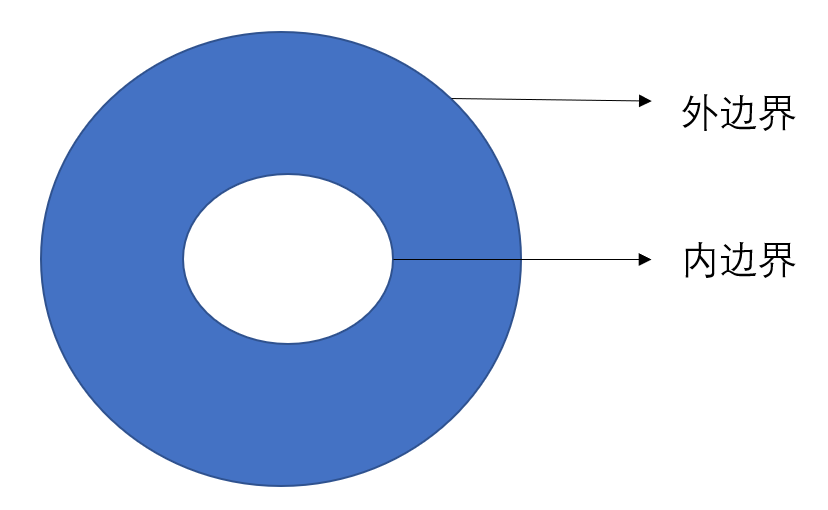

___

# 第十五章 重积分
___

## 二重积分
$\S$ 15.1
#### 曲顶柱体体积
$\S$ 15.1.1
- def : 曲顶为 $z=f(x,y)$, 定义在 $D\subset \mathbb R^2$ 上, 对 $D$ 作划分 $D=\cup_{i\in [n]}\{\Delta \sigma_i\}$. 任取 $(\xi_i,\eta_i)\in \Delta \sigma_i,\Delta v_i \approx f(\xi_i,\eta_i)\Delta\sigma_i$, 记 $d_i = \text{diam}(\Delta \sigma_i), d=\max d_i$, 则定义:
$$V=\lim_{d\to 0}\sum_{i\in [n]}f(\xi_i,\eta_i)\Delta\sigma_i$$
#### 平面集合面积
$\S$ 15.1.2
- def : 对集合 $A\subset \mathbb R$, $A^\circ$ 为内部, $\overline {A}$ 为闭包, 做间隔为 $\frac{1}{2^n}$ 的网格线划分, 内部小块之和为 $Q_n^-$, 包含边界和内部的小块之和为 $Q_n^+$, 记面积为 $mQ_n^-,mQ_n^+$, 若 $\lim_{n\to +\infty}mQ_n^-=\lim_{n\to +\infty}mQ_n^+$, 则称 $A$ **可求面积**, 此极限值记为 $mA$
- theorem : 平面点集 $A$ 可求面积 $\Leftrightarrow$ $\delta A$ 面积为 $0$. 
### 二重积分的定义
$\S$ 15.1.3

- def : 若平面有界有面积集合 $D$ 的 $\forall \Delta = \{\Delta \sigma_i\}_n, \forall (\xi_i,\eta_i)\in \Delta \sigma_i$, 对应的 Riemann 和极限存在且唯一, 则称 $f$ 在 $D$ 上可积, $I$ 为 $D$ 上**二重积分**.
$$I=\lim_{\|\Delta\|\to 0}\sum_{i\in [n]}f(\xi_i,\eta_i)\Delta\sigma_i =\iint_D f(x,y)\mathrm d\sigma$$
- theorem : 有界闭区域上可积函数必有界
> $\|\Delta\|\to 0\Rightarrow n\to +\infty$, 反之不然.
### 二元函数可积
$\S$ 15.1.4

- def, 记 $M_i=\sup_{\Delta_i} f(x,y),\; m_i =\inf_{\Delta_i} f(x,y), \; \omega_i = M_i-m_i$. $\overline S (f,\Delta) = \sum M_i\Delta \sigma_i$ 为**达布大和**, $\underline S (f,\Delta) = \sum m_i\Delta \sigma_i$ 为**达布小和**
> 此处 $\sum$ 与 $\sup,\inf$ 可交换
> 对 $\Delta$ 细化, 大和不增, 小和不减
> 划分1的小和<划分2的大和
- def : **上,下积分**
- theorem : (**Darboux 定理**) 
$$f(x,y)\in R(D)\Leftrightarrow \lim_{\|\Delta\|\to 0} \sum \omega_i \Delta \sigma_i = 0$$
  - 只计算内部区域块也对.

#### 二元可积函数类
$\S$ 15.1.5
- theorem : $E\subset D$(有界有面积), $mE = 0$, $f(x,y)\in C(D\setminus E)$, 则 $f\in R(D)$. 
  - 有界闭区域上连续函数和分片连续函数可积.
  - 两可积函数的乘积可积
- theorem : $m\leq f(x,y)\leq M$, $\varphi (z)\in C([m,M])$, 则 $f\in R(D)\Rightarrow \varphi \circ f\in R(D)$
> 涉及到有理数稠密等的函数可积性问题, 直接构造划分用振幅解决

#### 化二重积分为累次积分
$\S$ 15.1.7
- 设 $f\in R(D), D=[a,b]\times [c,d]$
  - 若 $\forall x\in [a,b]$, $I=\int_{c}^df(x,y)\mathrm dy \; \exists$, 则 $\iint_Df(x,y)\mathrm d\sigma = \int_{a}^{b}\mathrm dx\int_{c}^d f(x,y)\mathrm dy$
    - 将 $c,d$ 替换成在 $C([a,b])$ 的元素也成立
  - 若 $f\in C(D)$, 则 $\iint_Df(x,y)\mathrm d\sigma = \int_{a}^{b}\mathrm dx\int_{c}^d f(x,y)\mathrm dy = \cdots$
  - 若 $f (x,y)= g(x)h(y)$, 则 $\iint_Df(x,y)\mathrm d\sigma = \int_{a}^{b}\mathrm g(x)dx\int_{c}^d h(y)\mathrm dy$
- theorem : (重积分第一中值定理) 若 $f\in C(D), g\in R(D), g\ge 0$, 则 $\exist \xi \in D \text{ s.t. }$
$$\int_D f(\bm x)g(\bm x)\mathrm dv = f(\bm \xi)\int_D g(\bm x)\mathrm dv$$#### 二重积分与累次积分的存在性问题
> (1) 二重积分存在并不保证累次积分存在, 例如:
> $$D = [0,1]^2,f = \begin{cases}\frac{1}{k},\quad &x=\frac{1}{k},y\in \mathbb Q,k\in \mathbb N, \\0,&\text{o.w.}\end{cases}$$
> 固定 $x$ 后是狄利克雷函数, 不可积, 但是二重积分存在. 
> (2) 有累次积分存在, 可能二元积分不存在, 例如:
> $$D=[-1,1]^2,f = \begin{cases}0,\quad &x\in \mathbb Q, \\y,&\text{o.w.}\end{cases}$$
> (3) 累次积分存在且相等, 可能二元积分不存在, 例如:
> $$D=[0,1]^2,f = \begin{cases}1,\quad &x,y\text{都是既约分数且分母相等}, \\0,&\text{o.w.}\end{cases}$$

___
## 三重积分
$\S$ 15.2
___
## n重积分
$\S$ 15.3

- $n$ 重积分的定义性质等不必赘述, 关注如何计算即可.
> 连续函数具备大多数好的性质
___## 变量替换
$\S$ 15.4
### 二重积分的变量替换
- def : 设变量替换 $T:\begin{cases}x=x(u,v)\\y=y(u,v)\end{cases}$,$D_{xy}\to D_{uv}=T(D_{xy})$ 是微分同胚, 即 $T\in C^1(D_{uv}), \det J_T\neq 0$. (这导致 $T^{-1} \in C^1(D_{xy})$). 其中 $D_{xy},D_{uv}$ 边界可求长, 区域可求面积. 则 $T$ 满足:
- $T$ 把 $\delta D_{xy}$ 映满边界 $\delta D_{uv}$

> $\delta \Omega$ 的正向 : 逆时针, 沿着边界走动时, 区域在左边.

- theorem : 设同胚变换 $T$ 满足上述条件, $T$ 的 Jacobi 行列式 $\left|\frac{\partial(x,y)}{\partial(u,v)}\right| = \det J_T\neq 0$, $f(x,y)\in R(D_{xy})$, 则:
$$\iint_{D_{xy}}f(x,y)\mathrm d\sigma_{xy} = \iint_{D_{uv}}f(x(u,v),y(u,v))\left\|\frac{\partial(x,y)}{\partial(u,v)}\right\|\mathrm d\sigma_{uv}$$
> 注意极坐标要挖一条缝, $D_{r\theta} = \{(r,\theta)|0\leq r\leq R, 0\leq \theta\leq 2\pi\}$, 极坐标变化隐含了一个极限过程 (穷竭列 $D_{r\theta}^\epsilon$, $D_{xy}^\epsilon$)

### 多重积分的变量替换
定理概念略
> 普遍来说定义域好看了积分会变复杂, 积分好看了定义域会变复杂. 但是出题往往会根据定义域来凑积分, 因为定义域更直观, 因此做题还是定义域变换优先, 比如变成某种长方体.### 常用坐标系的微元
柱面坐标系: $(r,\theta,z)$, 平面极坐标系: $(r,\theta)$
$$\begin{cases} x = r\cos\theta \\ y = r\sin\theta \\ z = z \end{cases}, |J| = r$$
球面坐标系: $(r,\theta,\phi)$
$$\begin{cases} x = r\sin\phi\cos\theta \\ y = r\sin\phi\sin\theta \\ z = r\cos\phi \end{cases}, |J| = r^2\sin\phi$$
三角锥变平行多面体 : $0\leq x_i$, $\sum x_i\leq 1\Rightarrow u_i\in [0,1]$
$$\begin{cases} x_1 = u_1(1-u_2) \\ x_2 = u_1u_2(1-u_3) \\ \dots \\ x_{n-1} = u_1u_2\dots u_{n-1}(1-u_n) \\ x_n = u_1u_2\dots u_n \end{cases}, |J| = \prod_{i=1}^{n-1}u_i^{n-i}$$
> 积分限是什么? 先定最外层, 因为最外层是常数, 对于确定的最外层变元, 逐层确定内层变元的范围
## 广义重积分
$\S$ 15.5
- def : 设 $D\subset \mathbb R^2$ , $\forall R>0$, $D\cap \{x^2+y^2\leq R^2\}$ 可求面积, $\{D_n\}_{n=1}^\infty$ 是一列有界可求面积闭集, 满足
  - $D_1\subset D_2\subset \dots \subset D$
  - $\forall$ 有界闭集 $F\subset D$, $\exists m\in\mathbb N \text{ s.t. } F\subset D_m$
则称 $\{D_n\}$ 是 $D$ 的一个**穷竭列**.
- theorem : 区域的两个穷竭列将互相套娃式包含
- def : 如果 $f$ 在 $D$ 上任何可求面积的有界闭子区域上可积, 则称 $f$ 在 $D$ 上**内闭可积**  
- def : 设 $f$ 在 $D$ 上内闭可积, 若 $\forall \{D_n\}$ 都有 $\lim_{n\to\infty}\iint_{D_n}f(x,y)\mathrm d\sigma$ 存在唯一, 则称 $\iint_D f(x,y)\mathrm d\sigma$ 收敛, 并称此极限为 $f$ 在 $D$ 上的**广义重积分** :
$$\iint_D f(x,y)\mathrm d\sigma \overset{def}{=}   \lim_{n\to\infty}\iint_{D_n}f(x,y)\mathrm d\sigma$$ 
- theorem : $f$ 在   区域 $D\subset \mathbb R^2$上内闭可积, 则
$$\iint_D f(x,y) \mathrm d\sigma\text{ 收敛}\Leftrightarrow\iint_D |f(x,y)| \mathrm d\sigma\text{ 收敛}$$
> 广义积分只有绝对收敛, 没有条件收敛. 这是因为使用了穷竭列, 不需要列中闭集是联通的, 而不是像一元函数那样使用连续递增的子区间列.
> 比如 $\int_0^{+\infty}\frac{\sin x}{x}\mathrm dx$ 用穷竭列定义发散, 取 $D_n=[0,2k_{n-1}\pi]\cup\left(\bigcup_{k=k_{n-1}}^{k_n}[2k\pi,2k\pi+\pi]]\right)$. 这里是因为原积分条件收敛, 正部分发散, $\{k_n\}$ 可被取出.

- theorem : 设 $f(x,y)\ge 0$ 在 $D$ 上内闭可积, 则 $\iint_D f(x,y)\mathrm d\sigma $ 收敛的充要条件是存在 $D$ 的一个穷竭列 $\{D_n\}$ 使得 $\lim_{n\to\infty}\iint_{D_n}f(x,y)\mathrm d\sigma$ 存在. 且这两者有一存在时, 二者相等
  - 若 $\iint_D g(x,y)\mathrm d\sigma $ 发散, 则任意的穷竭列 $\iint_{D_n} |g(x,y)|\mathrm d\sigma = +\infty $
> 因为穷竭列是相互控制的
> 注意这个针对非负函数, 一般函数可能存在一个穷竭列收敛, 另一个发散的情况### 二元广义积分与累次广义积分的关系
$\S$ 15.5.3
- theorem : $f$ 在矩形区域 $D=[a,b]\times [c,d]$(可无限, 可暇) 内闭可积. 
  - 若 $\int_{c}^d\mathrm dy\int_{a}^b |f(x,y)|\mathrm dx$ 收敛, 则 $\iint_D f(x,y)\mathrm d\sigma$ 收敛且 $\int_{c}^d\mathrm dy\int_{a}^b f(x,y)\mathrm dx=\iint_D f(x,y)\mathrm d\sigma$
  - 若 $\int_{c}^d\mathrm dy\int_{a}^b |f(x,y)|\mathrm dx, \int_{a}^b\mathrm dx\int_{c}^d |f(x,y)|\mathrm dy$ 中有一个 $+\infty$, 则 $\iint_D f(x,y)\mathrm d\sigma$ 发散
> 在广义矩形区域上, 若两累次积分有一绝对收敛, 则二重积分收敛. 反之则不真. 而不广义的累次积分和二元积分没有相互决定的关系.
> 两累次积分均发散但二重积分收敛的例子:
> $$D= (0,1)^2,f(x,y)=\begin{cases}2^n, \quad & x=\frac{2m-1}{2^n}<1,0<y\leq \frac{1}{2^n},n\in \mathbb N,\\0 &o.w.\end{cases}$$
> $g(x,y)=f(x,y)+f(y,x)$
> 
> 在不加绝对值时, 存在累次积分收敛而二元广义积分发散的例子:
> $$D= (0,1)^2,f(x,y)=\begin{cases}-\frac{1}{y^2}, \quad & 0<x<y<1,\\\frac{1}{x^2}, &0<y<x<1\\0 &x=y\end{cases}$$
### 广义积分的变量替换
$\S$ 15.5.4
- theorem : 对于微分同胚, $\iint_{D_{xy}} f(x,y)\mathrm d\sigma_{xy} $ 和 $\iint_{D_{uv}} f(x,y)|J(u,v)|\mathrm d\sigma_{uv} $ 同敛散, 且收敛时二者相等
> 本质上是穷竭链的映射
> 这里极坐标变换也适用
> 二重反常积分的敛散性不仅依赖于被积函数, 还依赖于积分区域的形状
> 判断广义积分敛散性的方法: 变量替换, 比较判别法, 构造穷竭列 (都是累次积分绝对收敛)___

# 第十六章 曲线积分与曲面积分
___

## 基本概念
$\S$ 16.0 这一节其实是对第七章的复习

- def : 平面曲线 $L$ 的参数方程为 $\begin{cases}x=x(t)\\y=y(t)\end{cases}$, $a\leq t\leq b$, 若 $x(t),y(t)$ 在 $[a,b]$ 上连续, 则称 $L$ 为**连续曲线**
- def : 若 $(x(t_1),y(t_1))\neq (x(t_2),y(t_2))$, 则称 $L$ 为**简单曲线**
- def : 若  $(x(t_1),y(t_1))\neq (x(t_2),y(t_2))$ 但  $(x(a),y(a))\neq (x(b),y(b))$, 则称 $L$ 为**简单闭曲线**

### 曲线弧长
- def : 记 $\sigma(\Gamma,\Delta_\Gamma) = \sum_{i=1}^n |M_{i-1}M_i|$, 其中 $M_i$ 是 $\Gamma$ 上的分点, $\Delta_\Gamma$ 是分点集, 若 $\sup_{\forall \Delta_\Gamma}\sigma(\Gamma,\Delta_\Gamma)<+\infty$, 则称 $\Gamma$ **可求长**, 记为 $|\Gamma|$
- def : $\Gamma$ 的每一个分割 $A=M_0,M_1,\cdots,M_n=B$ 对应了参数区间 $[a,b]$ 的一个分割 $a=t_0<t_1<\cdots<t_n=b$, 称 $(\Delta_\Gamma,\Delta_t)$ 为 $\Gamma$ 的**分割对**
  - 连续非闭合曲线上分割对"尺度小"是一致的, 即 $\lambda(\Delta_\Gamma)\to 0\Leftrightarrow \lambda(\Delta_t)\to 0$
- theorem : $\Gamma$ 可求长的充要条件是 $x(t),y(t)\in BV[a,b]$
  -  $\sup_{\forall \Delta}\sum_{i=1}^n |f(t_i)-f(t_{i-1})|<+\infty$, 记为 $f\in BV[a,b]$, $f$ 为**有界变差函数**
  - 有界变差函数可以表示为两个单调递增函数之差
  - 有界变差函数有界
- 对于非闭合可求长的连续曲线(段) $\Gamma$, 弧长为:
$$|\Gamma| = \sup_{\forall \Delta_\Gamma}\sigma(\Gamma,\Delta_\Gamma)=\lim_{\lambda_\Delta\to 0}\sigma(\Gamma,\Delta_\Gamma)=\int_a^b \sqrt{x'(t)^2+y'(t)^2}\mathrm dt$$
- 对于可分割成至多可列个非闭合的连续曲线弧段的平面连续曲线, 定义其弧长为各段弧长之和, 也即:
$$|\Gamma| = \sum_{i=1}^n |\Gamma_i|=\sum_{i=1}^n\int_{t_{i-1}}^{t_i}\sqrt{x'(t)^2+y'(t)^2}\mathrm dt=\int_a^b \sqrt{x'(t)^2+y'(t)^2}\mathrm dt$$
- 设 $x(t),y(t)\in C^1[a,b]$, $x'(t)^2+y'(t)^2\neq 0$, 则 $\Gamma$ 最多时有有限个闭合点.

## I型曲线积分
$\S$ 16.1
- def : 设 $\Gamma$ 是平面可求长曲线, $f(x,y)$ 在 $\Gamma$ 上有定义, 若对任意分割的任意取点, $\lim_{\lambda(\Delta_\Gamma)\to 0}\sum_{i=1}^n f(x(t_i),y(t_i))\Delta s_i$ 存在且唯一, 则称此极限为 $f(x,y)$ 在 $\Gamma$ 上的**第一型曲线积分**, 记为 $\int_{\Gamma} f(x,y)\mathrm ds$. 对简单闭曲线, 记为 $\oint_{\Gamma} f(x,y)\mathrm ds$. 
  - $\mathrm ds = \sqrt{\mathrm dx^2+\mathrm dy^2}=\sqrt{x'(t)^2+y'(t)^2}\mathrm dt\ge 0$
- theorem : $\Gamma$ 是可求长简单曲线且 $f(x,y)\in C(\Gamma)$, 则 $\int_{\Gamma} f(x,y)\mathrm ds \exists$
$$\int_{\Gamma} f(x,y)\mathrm ds = \int_a^b f(x(t),y(t))\sqrt{x'(t)^2+y'(t)^2}\mathrm dt$$
- property:
  - $\int_{\widehat{AB}} f(x,y)\mathrm ds = \int_{\widehat{BA}} f(x,y)\mathrm ds$
  - $\int_{\Gamma} (k_1f(x,y)+k_2g(x,y))\mathrm ds = k_1\int_{\Gamma} f(x,y)\mathrm ds+k_2\int_{\Gamma} g(x,y)\mathrm ds$
  - $\int_{\Gamma} f(x,y)\mathrm ds = \int_{\Gamma_1} f(x,y)\mathrm ds+\int_{\Gamma_2} f(x,y)\mathrm ds \Leftrightarrow \Gamma = \Gamma_1+\Gamma_2$## II型曲线积分
$\S$ 16.2
- def : 设 $\Gamma$ 是有向非闭合连续线段, $A,B$ 分别表示起点和终点. 定义在 $\widehat{AB}$ 上的矢量函数 $\bm F(x,y,z)=(P(x,y,z),Q(x,y,z),R(x,y,z))$ 连续, 若对任意分割的任意取点和 $S_n(\Delta) = \sum_{i=1}^n \bm F(\xi_i)\cdot \Delta \bm s_i$, 极限 $\lim_{\lambda\to 0}S_n(\Delta)$ 存在, 则称此极限为 $\bm F$ 沿 $\Gamma$ 的**第二型曲线积分**, 记作 $\int_{\widehat{AB}}\bm F\cdot \mathrm d\bm s$ 或 $\int_{\widehat{AB}}P\mathrm dx+Q\mathrm dy+R\mathrm dz$.
> 第二型曲线积分是有积分方向的, $\mathrm ds$ 与第一型曲线积分的 $\mathrm ds$ 不同
> 被积函数是矢量函数, 被积元是矢量, 积分结果是标量
- property : 
  - $\int_{\widehat{AB}}\bm F\cdot \mathrm d\bm s = -\int_{\widehat{BA}}\bm F\cdot \mathrm d\bm s$ 
  - $\int_{\widehat{AB}}\bm F\cdot \mathrm d\bm s = \int_{\widehat{AC}}\bm F\cdot \mathrm d\bm s + \int_{\widehat{CB}}\bm F\cdot \mathrm d\bm s$
  - 闭路积分 : $\oint_{\Gamma}\bm F\cdot \mathrm d\bm s$
  - $\left|\int_{\Gamma}\bm F\cdot \mathrm d\bm s\right|\leqslant \int_{\Gamma}\|\bm F\|\mathrm ds$
- 若使用余弦计法 : $(\mathrm dx,\mathrm dy,\mathrm dz) = (\cos\alpha,\cos\beta,\cos\gamma)\mathrm ds$, $\mathrm ds = \sqrt{(\mathrm dx)^2+(\mathrm dy)^2+(\mathrm dz)^2}$, 其中 $\cos\alpha,\cos\beta,\cos\gamma$ 都是 $x,y,z$ 的连续函数, 则
$$\int_{\Gamma}P\mathrm dx+Q\mathrm dy+R\mathrm dz = \int_{\Gamma}(P\cos\alpha+Q\cos\beta+R\cos\gamma)\mathrm ds$$
- theorem : 设 $\Gamma$ 是有向光滑曲线 (即 $x(t),y(t),z(t)\in C^1[a,b]$, $x'(t)^2+y'(t)^2+z'(t)^2\neq 0$), $\bm F(x,y,z)\in C(\Gamma)$, 则第二型曲线积分存在, 且
$$\int_{\widehat{AB}}\bm F\cdot \mathrm d\bm s = \int_a^b\bm F(x(t),y(t),z(t))\cdot(x'(t),y'(t),z'(t))\mathrm dt$$

- theorem : $\Gamma$ 是 $D$ 内简单闭曲线, 则 $\forall \epsilon>0$, $\exists$ 节点在 $\Gamma$ 上的闭折线 $ \Lambda$, $D_\Gamma,D_\Lambda$ 分别为曲线围成的有界闭区域. 使得.
$$\left|\oint_\Lambda F\cdot \mathrm ds-\oint_\Gamma F\cdot \mathrm ds\right|<\epsilon, \left||D_\Lambda|-|D_\Gamma|\right|<\epsilon$$ 
> 规定 $\delta D$ 的微元的正向是区域在左侧## 各类积分之间的联系
$\S$ 16.3
### Green 公式
$\S$ 16.3.1

- theorem : (Green 公式) 平面闭区域由有限条可求长简单闭曲线围成, $\partial D$ 表示正向边界, $P,Q,\frac{\partial Q}{\partial x},\frac{\partial P}{\partial y}\in C(D)$. 则有:
$$\oint_{\partial D}P\mathrm dx+Q\mathrm dy = \iint_{D}\begin{vmatrix}\frac{\partial }{\partial x} & \frac{\partial }{\partial y} \\ P & Q \end{vmatrix}\mathrm d\sigma $$
> 边界正向选取 : 内顺外逆
> Green 公式是联系平面积分与边界线积分的桥梁
> 非闭曲线上的线积分可以变成闭曲线上线积分再用 Green 公式
- Green 公式的向量形式 : 
$$\oint_{\partial D}(P,Q)\cdot \mathrm ds = \oint_{\partial D}(P,Q)\cdot (\mathrm dx,\mathrm dy) = \oint_{\partial D}(P,Q)\cdot \bm\tau \mathrm ds = \iint_{D}\left(\frac{\partial Q}{\partial x}-\frac{\partial P}{\partial y}\right)\mathrm d\sigma$$
其中 $\bm\tau$ 表示正向单位切向量, $\bm\tau = (\cos\theta,\sin\theta) = \frac{(\mathrm dx,\mathrm dy)}{\mathrm ds}$

- theorem : (二维 Stokes 公式) $P,Q,\frac{\partial Q}{\partial y},\frac{\partial P}{\partial x}\in C(D)$. 则有:
$$\oint_{D} (\frac{\partial Q}{\partial y}+\frac{\partial P}{\partial x})\mathrm d\sigma = \oint_{\partial D}\{P,Q\}\cdot \boldsymbol n\;\mathrm ds = \oint_{\partial D}(P\cos(\boldsymbol n,x)+Q\cos (\boldsymbol n,y))\mathrm ds$$
其中 $\boldsymbol n$ 表示外法向量, 两个余弦内角是其分别与 $x,y$ 轴正向的夹角.
> $\boldsymbol n\cdot \mathrm ds = (\mathrm dy,-\mathrm dx)$, 所以两个公式其实就是互换 $P,Q$
> Green 公式描述 $P,Q$ 在切向量上的投影, 二维 Stokes 公式描述 $P,Q$ 在法向量上的投影 

#### wgx物理小课堂
- 流场 $v=(P(x,y),Q(x,y))$
- 点的**旋度** : $\frac{\partial Q}{\partial x}-\frac{\partial P}{\partial y}$
- 边界 $\partial D$ 的**环流量** : $\oint_{\partial D}P\mathrm dx+Q\mathrm dy$
> 边界线上环流量等于区域上各点旋度的叠加. $\Leftrightarrow$ Green公式
> $$\oint_{\partial D} \bm v\cdot \bm \tau\mathrm ds = \iint_D \text{rot } \bm v\mathrm d\sigma$$
- 点的**散度** : $\text{div} \; v = \nabla \cdot v = \frac{\partial P}{\partial x}+\frac{\partial Q}{\partial y}$ (这个没有方向), 单位体积单位时间生出的流体量
  - 散(san,四声)
  - **汇, 源** : 有水漏出, 有水生成的地方
- 边界的**总通量** : $\oint \boldsymbol{v}\cdot\boldsymbol{n}\mathrm ds$
> 边界线上总通量等于区域上各点散度的叠加. $\Leftrightarrow$ Gauss公式二维情形
> $$\oint_{\partial D}v\cdot \boldsymbol{n} \mathrm ds = \iint_D \text{div }v\mathrm d\sigma$$
> wgx认为这个积分用好了后面都很自然
#### 调和函数
- def : $\Delta u = 0$, 则称 $u$ 为**调和函数**.
  - $\Delta u = \nabla \cdot \nabla u$
- theorem : (Green 第二公式) $D$ 由有限条逐段光滑曲线围成, $u,v\in C^2(D)$, 则有
$$\begin{align*}\iint_D \Delta u\mathrm d\sigma &= \oint_{\partial D}\frac{\partial u}{\partial \boldsymbol{n}}\mathrm ds\\\iint_D v\Delta u\mathrm d\sigma &= -\iint_{D}(\frac{\partial u}{\partial x}\frac{\partial v}{\partial x}+\frac{\partial u}{\partial y}\frac{\partial v}{\partial y})\mathrm d\sigma +\oint_{\partial D}v\frac{\partial u}{\partial \boldsymbol{n}}\mathrm ds\\\iint_D (v\Delta u-u\Delta v)\mathrm d\sigma &= \oint_{\partial D}(v\frac{\partial u}{\partial \boldsymbol{n}}-u\frac{\partial v}{\partial \boldsymbol{n}})\mathrm ds\end{align*}$$

>  $\nabla\cdot(v\nabla u)=\nabla v\cdot\nabla u +v\nabla u$
### 平面曲线积分与路径无关的条件
$\S$ 16.3.2
- theorem : $\forall A,B\in D$, $\int_{\overset{\frown}{AB} } P\mathrm dx+Q\mathrm dy$ 与路径无关的充要条件是任意闭曲线 $C\subset D$ 均有 $\oint_C P\mathrm dx+Q\mathrm dy=0$
> 这是区域 $D$ 性质, 不是指定两点的性质.
- theorem : $\forall A,B\in D$, $P,Q\in C(D)$, $\int_{\overset{\frown}{AB} } P\mathrm dx+Q\mathrm dy$ 与路径无关的充要条件是 $\exists$ 定义在 $D$ 上的可微函数 $u$, 使得 $\mathrm du = P\mathrm dx+Q\mathrm dy, \forall (x,y)\in D$
> 积分与路径无关的充要条件是, 在整个区域上, 被积表达式是一个全微分.
- theorem : 设 $P,Q,\frac{\partial P}{\partial y}, \frac{\partial Q}{\partial x}$, 在单连通区域上连续, 则 "...与路径无关" $\Leftrightarrow$ 
$$\frac{\partial P}{\partial y} = \frac{\partial Q}{\partial x}, \forall (x,y)$$
> 关于被积表达式是否是全微分, 有三种方法确定, 直接积, 积单变量, 直接观察.

## 曲面积分
$\S$ 16.4
### 曲面面积
$\S$ 16.4.1 

- theorem : 若曲面由 $z=f(x,y)$ 给定, 投影区域为 $D_{xy}$, 则
$$\mathrm dS=\sqrt{1+f_x'^2+f_y'^2}\mathrm d\sigma_{xy}$$
- def : (参数式曲面) $(x(u,v),y(u,v),z(u,v))$, 均$\in C^1$, 且 $A=\left|\frac{\partial (y,z)}{\partial (u,v)}\right|, B=\cdots$ 不同时为 $0$.
  - theorem : $\tau_1 = (\frac{\partial z}{\partial u},\frac{\partial y}{\partial u},\frac{\partial z}{\partial u})$, $\tau_2 = \cdots$, $E=|\tau_1|^2$, $G=|\tau_2|^2$, $F=|\tau_1\cdot\tau_2|$
$$\mathrm dS = \sqrt{A^2+B^2+C^2} \mathrm d\sigma_{uv} = \sqrt{EG-F^2} d\sigma_{uv}$$### I型曲面积分
$\S$ 16.4.2

$$\iint_\Sigma f(x,y,z)\mathrm dS=\iint_{D_{xy}}f(x,y,z(x,y))\sqrt{1+\left(\frac{\partial z}{\partial y}\right)^2+\left(\frac{\partial z}{\partial x}\right)^2}\mathrm d\sigma_{xy}$$

- def : 设 $\Sigma\subset \mathbb R^3$ 是分片光滑可求面积的双侧曲面, 若它有边界, 则它的边界是由有限条光滑曲面组成. 给定 $\Sigma$ 一侧, $\Sigma$ 上每点 $(x,y,z)$ 处的该侧的单位法向

> 如果把 $\boldsymbol n\mathrm dS$ 看作向量, 记为 $\mathrm d\boldsymbol S$, 则 $\mathrm d\boldsymbol S = (\cos\alpha\mathrm dS,\cos\beta\mathrm dS,\cos\gamma\mathrm dS)$

$$\begin{align*}\iint_\Sigma F(x,y,z)\boldsymbol n\mathrm dS &= \iint_\Sigma F(x,y,z)\mathrm d\boldsymbol S \\&=\iint_\Sigma P(x,y,z)\mathrm dy\mathrm dz+Q(x,y,z)\mathrm dz\mathrm dx+R(x,y,z)\mathrm dx\mathrm dy\end{align*}$$

### II型曲面积分
$\S$ 16.4.3

- theorem : (Gauss 公式), 有界闭 $\Omega\subset \mathbb R^3$, 其边界曲面 $(\partial \Omega)$ 分片光滑, $P,Q,R,\frac{\partial P}{\partial x},\frac{\partial Q}{\partial y},\frac{\partial R}{\partial z}\in C(Q)$, 则有
$$\oiint_{\partial\Omega} P\mathrm dy\mathrm dz+Q\mathrm dz\mathrm dx+R\mathrm dx\mathrm dy =\iiint_{\Omega} \left(\frac{\partial P}{\partial x}+\frac{\partial Q}{\partial y}+\frac{\partial R}{\partial z}\right)\mathrm dv$$

- theorem : (Stokes 公式), 设光滑双侧曲面 $\Sigma$ 有界有边含于空间区域 $\Omega$, 其边界 $\partial \Sigma$ 由有限条分段光滑曲线组成, 并且 $\Sigma$ 的正侧与边界 $\partial \Sigma$ (空间闭曲线) 正向按右手法则取定, 函数 $P,Q,R\in C^1(\Omega)$, 则有
$$\begin{align*}&\oint_{\partial \Sigma} P\mathrm dx+Q\mathrm dy+ R\mathrm dz\\=&\iint_{\Sigma}\left(\frac{\partial R}{\partial y}-\frac{\partial Q}{\partial z}\right)\mathrm dy\mathrm dz+\left(\frac{\partial P}{\partial z}-\frac{\partial R}{\partial x}\right)\mathrm dz\mathrm dx+\left(\frac{\partial Q}{\partial x}-\frac{\partial P}{\partial y}\right)\mathrm dx\mathrm dy\end{align*}$$
其中
$$\oint_{\partial \Sigma} P\mathrm dx = \iint_{\Sigma}\left(\frac{\partial P}{\partial z}\mathrm dz\mathrm dx-\frac{\partial P}{\partial y}\mathrm dx\mathrm dy\right)$$

> 换一个好记的写法:
> $$\begin{align*}&\oint_{\partial \Sigma} P\mathrm dx+Q\mathrm dy+ R\mathrm dz\\=&\iint_{\Sigma}\begin{bmatrix}\cos \alpha & \cos \beta & \cos \gamma\\\frac{\partial}{\partial z}& \frac{\partial}{\partial y}&\frac{\partial}{\partial z}\\ P&Q&R\end{bmatrix}\mathrm dS\\&\iint_{\Sigma}\begin{bmatrix}\mathrm dy\mathrm dz&\mathrm dz\mathrm dx&\mathrm dx\mathrm dy\\\frac{\partial}{\partial z}& \frac{\partial}{\partial y}&\frac{\partial}{\partial z}\\ P&Q&R\end{bmatrix}\end{align*}$$## 散度与旋度
$\S$ 16.5

- def : 矢量算子 $\nabla = (\frac{\partial}{\partial x},\frac{\partial}{\partial y},\frac{\partial}{\partial z})$
- def : 设流速为 $\vec{F}(x,y,z) = (P(x,y,z),Q(x,y,z),R(x,y,z))$, 则定义 $\vec{F}$ 的**旋度**为
$$\begin{align*}\text{rot}\vec{F} &= \left(\frac{\partial R}{\partial y}-\frac{\partial Q}{\partial z}\right)\vec{i}+\left(\frac{\partial P}{\partial z}-\frac{\partial R}{\partial x}\right)\vec{j}+\left(\frac{\partial Q}{\partial x}-\frac{\partial P}{\partial y}\right)\vec{k}\\&=\left|\begin{matrix}\vec{i} & \vec{j} & \vec{k}\\\frac{\partial}{\partial x}& \frac{\partial}{\partial y}&\frac{\partial}{\partial z}\\ P&Q&R\end{matrix}\right|\end{align*}$$
> Stokes 公式的向量形式
> $$\iint_{\Sigma} \text{rot} \vec{F}\cdot\vec{n}\mathrm dS=\oint_L \vec{F}\cdot \mathrm d\vec{s}$$
- def : 定义 $\vec{F}$ 的**散度**为
$$\text{div}\vec{F} = \frac{\partial P}{\partial x}+\frac{\partial Q}{\partial y}+\frac{\partial R}{\partial z} = \nabla\cdot\vec{F}$$
> 注意 $\nabla f$ 和 $\nabla\cdot F$ 的区别, 前者是梯度
> Gauss 公式的向量形式
> $$\oiint_{\Sigma^+} \vec{F}\cdot\vec{n}\mathrm dS = \iiint_{\Omega} \text{div}\vec {F}\mathrm dv$$
- def : 如果区域 $\Omega\subset \mathbb R^3$ 内的任何简单闭曲面所围的体都完全属于 $\Omega$, 则称其为**单连通区域** (没有空腔) 
- theorem : (散度定理) 对单连通区域 $\Omega$, 任意点的散度为 $0$ $\Leftrightarrow$ 任意闭曲面上通量为 $0$ $\Leftrightarrow$ II型曲面上通量只与边界有关与面位无关
> 为什么 stokes 公式是对的? 因为旋通量与面位无关, 换句话说旋度的散度为 $0$ : $\text{div}(\text{rot}\vec{F}) = 0$
- def : 如果区域 $\Omega$ 内的任何闭曲线都可以张成(至少)一张完全属于 $\Omega$ 的曲面, 则称 $\Omega$ 为 **线单连通区域** (区域内任何简单闭曲线都可以连续收缩成一点)
> 球壳线单连通, 但不单连通. 轮胎单连通, 但不线单连通
- theorem : (空间线积分与路径无关定理) $\Omega$ 是线单连通区域, 两点间积分与路径无关 $\Leftrightarrow$ 存在可微函数 $u$ 的全微分是 $P\mathrm dx+Q\mathrm dy+R\mathrm dz$ $\Leftrightarrow$ 旋度处处为 $0$.
> 路径流量与路径无关 $\Leftrightarrow$ 有势场 $\Leftrightarrow$ 无旋场

___

# 第十七章 含参变量积分

___

## 含参变量的定积分
$\S$ 17.1
- def : 所谓**含参变量定积分**, $x$ 是参变量
$$ I(x) = \int_{c}^{d} f(x,y)\mathrm dy$$
- lemma : 设 $f\in C(D)$, $F(x,y) = \int_{c}^{y} f(x,t)\mathrm dt$, $y\in [c,d]$, 则 $F(x,y)\in C(D)$ (二元连续函数对其中一个变量做变上限积分, 则结果是二元连续函数)
- theorem : $f\in C(D)\Rightarrow I(x)\in C([a,b])$, 且此时对参数取极限与积分运算可交换
$$\lim_{x\to x_0}\int_{c}^{d} f(x,y)\mathrm dy = \int_{c}^{d} \lim_{x\to x_0} f(x,y)\mathrm dy$$
- theorem : 
$$f\in C(D)\Rightarrow J(x) = \int_{\psi(x)}^{\varphi(x)} f(x,y)\mathrm dy\in C([a,b])$$
- theorem : $f\in C(D), f_x'\in C(D) \Rightarrow I(x)\in C^1([a,b])$, 且此时对参数求导与积分运算可交换
$$\frac{\mathrm d}{\mathrm dx} \int_{c}^{d} f(x,t)\mathrm dt =  \int_{c}^{d} \frac{\partial f(x,t)}{\partial x}\mathrm dt$$
- theorem :  $f\in C(D), f_x'\in C(D), \psi,\varphi$ 在$[a,b]$可微,$c\leq \psi,\varphi\leq d$ $\Rightarrow J(x)\in C^1([a,b])$, 且此时
$$J'(x) = \int_{\psi(x)}^{\varphi(x)} f_x'(x,t)\mathrm dt - f(x,\psi(x))\psi'(x)+f(x,\varphi(x))\varphi'(x) $$
## 含参变量的广义积分
$\S$ 17.2
### 一致收敛
$\S$ 17.2.1
- def : 若 $\forall \epsilon>0, \exists A_0>c \text{ s.t. } \left|\int_{A}^{+\infty}f(x,y)\mathrm dy\right|<\epsilon,\forall x\in [a,b], \forall A>A_0$, 则称 $\int_{A}^{+\infty}f(x,y)\mathrm dy$ 关于 $x$ 在 $[a,b]$ 上**一致收敛**.
> 将 $[a,b]$ 换成 $\mathbb R$ 的一般区间同样定义
> Cauchy 一致收敛 : 一致收敛等价于在 $[A',A'']$ 上的积分 $<\epsilon$
> Weiersrass 判别法 : 找一个控制函数夹住 $f$, 如果该函数一致收敛则 $f$ 一致收敛
- theorem : (Dirichlet 判别法) 若
  (1) $\exists M>0 \text{ s.t. } \left|\int_{c}^Af(x,y)\mathrm dy\right|\leq M, \forall A>c, \forall x\in E$, 即关于 $x$ 及 $A$ **一致有界**
  (2) $\forall x\in E$, $g(x,y)$ 关于 $y$ 单调, 且 $g(x,y)\rightrightarrows0 (y\rightarrow +\infty,x\in E)$
则 $\int_c^{+\infty}f(x,y)g(x,y)\mathrm dy$ 对 $x\in E$ 一致收敛 
- theorem : (Abel 判别法) 若
  (1) $\int_{c}^{+\infty} f(x,y)\mathrm dy$ 关于 $x\in E$ 一致收敛
  (2)  $\forall x\in E$, $g(x,y)$ 关于 $y$ 单调, 且 $\exists M>0 \text{ s.t. } |g(x,y)|\leq M, \forall x\in E, \forall y\in [c,+\infty)$
则 $\int_c^{+\infty}f(x,y)g(x,y)\mathrm dy$ 对 $x\in E$ 一致收敛.
### 含参变量无穷积分的性质
$\S$ 17.2.2
- def : 若 $\int_c^{+\infty}|f(x,y)|\mathrm dy$ 关于 $x\in E$ 一致收敛, 则称 $\int_c^{+\infty}f(x,y)\mathrm dy$ 关于 $x\in E$ **绝对一致收敛**.
> 一致收敛 $\Rightarrow$ 绝对一致收敛
- theorem : (将无穷积分理解为函数列的极限) $\int_c^{+\infty}f(x,y)\mathrm dy$ 关于 $x\in E$ 一致收敛的充分必要条件是, 对任意的满足条件 $c<t_1<t_2<\dots<t_n<+\infty,\lim_{n\to +\infty}t_n=+\infty$ 的序列 $\{t_n\}$, 函数列 $F_n(x)=\int_{c}^{t_n}f(x,y)\mathrm dy$ 关于 $x\in E$ 一致收敛 
- theorem : (含参变量无穷积分的连续性) 设 $f$ 在 $[a,b]\times [c,+\infty)$ 上连续,  且 $\int_c^{+\infty}f(x,y)\mathrm dy$ 关于 $x\in E$ 一致收敛, 则 $\int_c^{+\infty}f(x,y)\mathrm dy$ 在 $E$ 上连续
- theorem : (积分可交换) 设 $f$ 在 $[a,b] \times [c,+\infty)$ 上连续, 且 $\int_c^{+\infty}f(x,y)\mathrm dy$ 关于 $x\in [a,b]$ 一致收敛, 则
$$\int_a^b\left(\int_c^{+\infty}f(x,y)\mathrm dy\right)\mathrm dx = \int_c^{+\infty}\left(\int_a^bf(x,y)\mathrm dx\right)\mathrm dy$$
- theorem : (可导) 设 $f(x,y),f_x'(x,y)$ 在 $[a,b]\times[c,+\infty)$ 上连续, 且 $\int_c^{+\infty}f'(x,y)\mathrm dy$ 关于 $x\in [a,b]$ 一致收敛, 且存在 $x_0\in [a,b]$ 使得 $\int_c^{+\infty}f(x_0,y)\mathrm dy$ 收敛, 则
(1) $J(x)=\int_c^{+\infty}f(x,y)\mathrm dy$ 在 $[a,b]$ 上一致收敛
(2) $J'(x) = \int_c^{+\infty}f_x'(x,y)\mathrm dy$
> 可导和可交换是照搬含参变量定积分的性质
- theorem : (类似 Dini 定理) 设 $f(x,y)$ 在 $[a,b]\times[c,+\infty)$ 上连续非负, $\forall x\in [a,b],\int_c^{+\infty}f(x,y)\mathrm dy$ 关于收敛, 且 $I(x)\in C[a,b]$, 则 $\int_c^{+\infty}f(x,y)\mathrm dy$ 关于 $x\in [a,b]$ 一致收敛
> 非负函数逐点收敛则一致收敛
- theorem : (关于两个参数的一致收敛) 设 $f(x,y)$ 在 $[a,+\infty)\times[c,\infty)$ 上连续, 且 $\int_c^{+\infty}f(x,y)\mathrm dy$ 关于 $x\in [a,+\infty)$ 内闭一致收敛, 且 $\int_a^{+\infty}f(x,y)\mathrm dx$ 关于 $y\in [c,+\infty)$ 内闭一致收敛, 且 $\int_c^{+\infty}\left(\int_a^{+\infty}|f(x,y)|\mathrm dx\right)\mathrm dy$ 与 $\int_a^{+\infty}\left(\int_c^{+\infty}|f(x,y)|\mathrm dy\right)\mathrm dx$ 有一存在, 则 
$$\int_a^{+\infty}\left(\int_c^{+\infty}f(x,y)\mathrm dy\right)\mathrm dx = \int_c^{+\infty}\left(\int_a^{+\infty}f(x,y)\mathrm dx\right)\mathrm dy$$
- theorem : 设$f(x,y)$ 在 $[a,+\infty)\times[c,\infty)$ 上连续非负, 且 $\int_c^{+\infty}f(x,y)\mathrm dy$ , $\int_a^{+\infty}f(x,y)\mathrm dx$ 连续, 且 $\int_c^{+\infty}\left(\int_a^{+\infty}|f(x,y)|\mathrm dx\right)\mathrm dy$ 与 $\int_a^{+\infty}\left(\int_c^{+\infty}|f(x,y)|\mathrm dy\right)\mathrm dx$ 有一存在, 则两者存在且相等
## $\Gamma$ 函数与 $\Beta$ 函数
$\S$ 17.3
### $\Gamma$ 函数
- def : $\Gamma(x)=\int_0^{+\infty}t^{x-1}\mathrm{e}^{-t}\mathrm{d}t, x>0$
- property :
  - $\Gamma(x+1)=x\Gamma(x)$
  - $\Gamma(x)=2\int_0^{+\infty}s^{2x-1}\mathrm{e}^{-s^2}\mathrm{d}s$ (变换$t=s^2$)
  - $\Gamma(x)\in C^{\infty}(0,+\infty)$
  - $\Gamma(x)$ 与 $\ln\Gamma(x)$ 在 $(0,+\infty)$ 上严格凸

### $\Beta$ 函数
- def : $\Beta(x,y)=\int_0^1t^{x-1}(1-t)^{y-1}\mathrm{d}t, x>0, y>0$'
- property:
  - $\Beta(x,y)=\Beta(y,x)$
  - $\Beta(x,y)=\frac{x-1}{x+y-1}\Beta(x-1,y)$
  - $\Beta(x,y)=2\int_0^{\frac{\pi}{2}}(\sin\theta)^{2x-1}(\cos\theta)^{2y-1}\mathrm{d}\theta$ (变换$t=\sin^2\theta$)
  - $\Beta(x,y)=\int_0^{+\infty}\frac{s^{x-1}}{(1+s)^{x+y}}\mathrm{d}s$ (变换$t=\frac{s}{1+s}$)

### $\Gamma$ 函数与 $\Beta$ 函数的关系
- $\Beta(x,y)=\frac{\Gamma(x)\Gamma(y)}{\Gamma(x+y)}$
- (余元公式) $\Gamma(x)\Gamma(1-x)=\Beta(x,1-x)=\frac{\pi}{\sin\pi x}$___
# 速记
___
## 场论记号
- 梯度场：$\nabla f = \text{grad} f = \left(\frac{\partial f}{\partial x},\frac{\partial f}{\partial y},\frac{\partial f}{\partial z}\right)$
- 散度场：$\nabla\cdot \vec{F} = \text{div} \vec{F} = \frac{\partial P}{\partial x}+\frac{\partial Q}{\partial y}+\frac{\partial R}{\partial z}$
- 旋度场：$\nabla\times \vec{F} = \text{rot} \vec{F} = \left(\frac{\partial R}{\partial y}-\frac{\partial Q}{\partial z}\right)\vec{i}+\left(\frac{\partial P}{\partial z}-\frac{\partial R}{\partial x}\right)\vec{j}+\left(\frac{\partial Q}{\partial x}-\frac{\partial P}{\partial y}\right)\vec{k} = \left|\begin{matrix}\vec{i} & \vec{j} & \vec{k}\\\frac{\partial}{\partial x}& \frac{\partial}{\partial y}&\frac{\partial}{\partial z}\\ P&Q&R\end{matrix}\right|$
- 拉普拉斯算子：$\Delta f = \nabla\cdot \nabla f = \nabla^2 f = \frac{\partial^2 f}{\partial x^2}+\frac{\partial^2 f}{\partial y^2}+\frac{\partial^2 f}{\partial z^2}$

## 反例
**二重积分与累次积分的存在性问题**
> (1) 二重积分存在并不保证累次积分存在, 例如:
> $$D = [0,1]^2,f = \begin{cases}\frac{1}{k},\quad &x=\frac{1}{k},y\in \mathbb Q,k\in \mathbb N, \\0,&\text{o.w.}\end{cases}$$
> 固定 $x$ 后是狄利克雷函数, 不可积, 但是二重积分存在. 
> (2) 有累次积分存在, 可能二元积分不存在, 例如:
> $$D=[-1,1]^2,f = \begin{cases}0,\quad &x\in \mathbb Q, \\y,&\text{o.w.}\end{cases}$$
> (3) 累次积分存在且相等, 可能二元积分不存在, 例如:
> $$D=[0,1]^2,f = \begin{cases}1,\quad &x,y\text{都是既约分数且分母相等}, \\0,&\text{o.w.}\end{cases}$$

**广义重积分的敛散性**
> 两累次积分均发散但二重积分收敛的例子:
> $$D= (0,1)^2,f(x,y)=\begin{cases}2^n, \quad & x=\frac{2m-1}{2^n}<1,0<y\leq \frac{1}{2^n},n\in \mathbb N,\\0 &o.w.\end{cases}$$
> $g(x,y)=f(x,y)+f(y,x)$
> 
> 在不加绝对值时, 存在累次积分收敛而二元广义积分发散的例子:
> $$D= (0,1)^2,f(x,y)=\begin{cases}-\frac{1}{y^2}, \quad & 0<x<y<1,\\\frac{1}{x^2}, &0<y<x<1\\0 &x=y\end{cases}$$